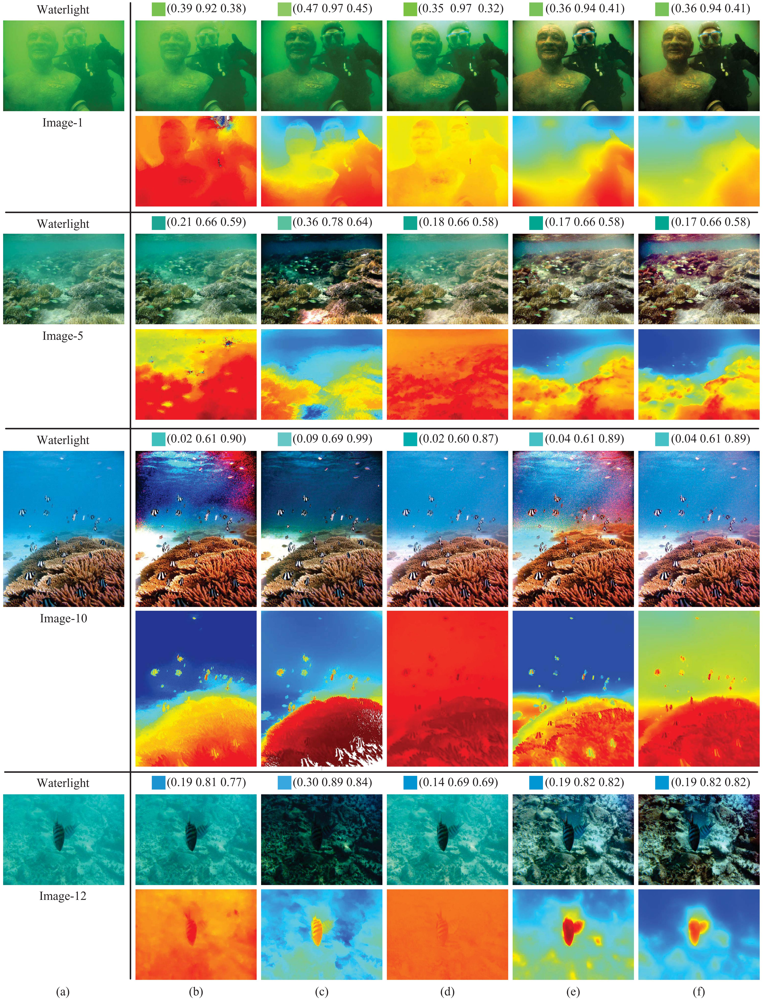

# AAP-underwater-image-restoration
Adaptive attenuation-curve (AAC) prior for underwater image restoration. [paper](https://ieeexplore.ieee.org/abstract/document/8049307)

We propose a novel underwater image restoration method based on a non-local prior, namely, adaptive attenuation-curve prior. This prior relies on the statistical distribution of pixel values. That is, all pixel values of a clear image can be partitioned into several hundred distinct clusters in RGB space (see Fig. 1 (b)), and the pixel values in each cluster will be distributed on a curve with a power function form after attenuated by water in varying degrees (see Fig. 1 (d)). Specifically, we can estimate the transmission for each pixel according to its distribution on the curves.

<p align="center">
  
</p>


## Link of experimental results and code

[Experimental Results](https://drive.google.com/file/d/1KTdPS3Ih9_NOmHHA9QEZNn92lrvIS6rc/view?usp=sharing)

[Matlab Executable file](https://drive.google.com/file/d/1fypBfNu-k2thxFpfQa4hVyBCbJ9FMsTp/view?usp=sharing)(Due to the project limitation, only the executable file can be provided)

## Example results


The visual comparison of four underwater images with different scenes. (a) The original image. The restored results, and the corresponding waterlight and transmission yielded by: (b) MIP [4], (c) UDCP [8], (d) blurriness-based method [9], (e) fixed-attenuation-curve method [5], (f) the proposed method (adaptive attenuation-curve).

# Citation
If you find this research project is useful for your research, please cite:
```
@article{wang2018single,
  title={Single underwater image restoration using adaptive attenuation-curve prior},
  author={Wang, Yi and Liu, Hui and Chau, Lap-Pui},
  journal={IEEE Transactions on Circuits and Systems I: Regular Papers},
  volume={65},
  number={3},
  pages={992--1002},
  year={2018},
  publisher={IEEE}
}
```
